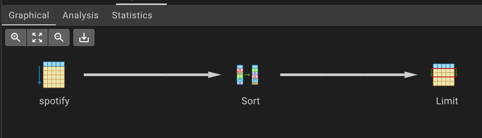
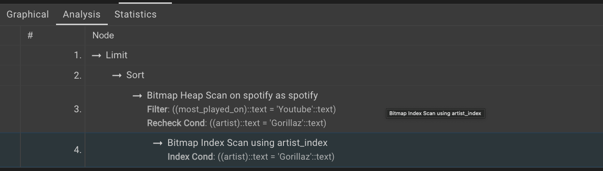

# Spotify Advanced SQL Analytics

Advanced SQL analytics project using PostgreSQL to analyze Spotify listening data, derive business insights, and optimize query performance through indexing and execution plan analysis.

**Dataset:** [Spotify Dataset (Kaggle)](https://www.kaggle.com/datasets/sanjanchaudhari/spotify-dataset)

<p align="center">
  
</p>
---

# Overview

This project explores Spotify listening data using advanced SQL techniques to analyze artist, album, and track performance. It demonstrates SQL concepts ranging from basic aggregations to advanced analytical queries while showcasing query optimization using indexing and `EXPLAIN ANALYZE`.

The project includes:

- 15 analytical SQL problems
- CTEs and Window Functions
- Aggregations and Subqueries
- Query Optimization
- Execution Plan Analysis

```sql
-- create table
DROP TABLE IF EXISTS spotify;
CREATE TABLE spotify (
    artist VARCHAR(255),
    track VARCHAR(255),
    album VARCHAR(255),
    album_type VARCHAR(50),
    danceability FLOAT,
    energy FLOAT,
    loudness FLOAT,
    speechiness FLOAT,
    acousticness FLOAT,
    instrumentalness FLOAT,
    liveness FLOAT,
    valence FLOAT,
    tempo FLOAT,
    duration_min FLOAT,
    title VARCHAR(255),
    channel VARCHAR(255),
    views FLOAT,
    likes BIGINT,
    comments BIGINT,
    licensed BOOLEAN,
    official_video BOOLEAN,
    stream BIGINT,
    energy_liveness FLOAT,
    most_played_on VARCHAR(50)
);
```
## Project Steps

### 1. Data Exploration
Before diving into SQL, it’s important to understand the dataset thoroughly. The dataset contains attributes such as:
- `Artist`: The performer of the track.
- `Track`: The name of the song.
- `Album`: The album to which the track belongs.
- `Album_type`: The type of album (e.g., single or album).
- Various metrics such as `danceability`, `energy`, `loudness`, `tempo`, and more.

### 4. Querying the Data
After the data is inserted, various SQL queries can be written to explore and analyze the data. Queries are categorized into **easy**, **medium**, and **advanced** levels to help progressively develop SQL proficiency.

#### Easy Queries
- Simple data retrieval, filtering, and basic aggregations.
  
#### Medium Queries
- More complex queries involving grouping, aggregation functions, and joins.
  
#### Advanced Queries
- Nested subqueries, window functions, CTEs, and performance optimization.

### 5. Query Optimization
In advanced stages, the focus shifts to improving query performance. Some optimization strategies include:
- **Indexing**: Adding indexes on frequently queried columns.
- **Query Execution Plan**: Using `EXPLAIN ANALYZE` to review and refine query performance.
  
---

## 15 Practice Questions

### Easy Level
1. Retrieve the names of all tracks that have more than 1 billion streams.
   ```sql
   SELECT * FROM spotify 
	WHERE stream >1000000000;
   ``` 
2. List all albums along with their respective artists.
```sql
   SELECT distinct album, artist FROM SPOTIFY ORDER BY 1; 
	SELECT distinct album FROM SPOTIFY ORDER BY 1;
   ```
3. Get the total number of comments for tracks where `licensed = TRUE`.
      ```sql
   SELECT SUM(comments) FROM spotify 
	WHERE licensed = 'TRUE';
   ```
4. Find all tracks that belong to the album type `single`.
      ```sql
   SELECT * FROM SPOTIFY 
		WHERE album_type = 'single';
      -- or 
	SELECT * FROM SPOTIFY 
		WHERE album_type ILIKE 'single';
   ```
5. Count the total number of tracks by each artist.

 ```sql
SELECT
	artist ,
	COUNT(*) AS Total_no_of_songs
FROM spotify 
GROUP BY artist 
ORDER BY 2 DESC;
```

### Medium Level
6. Calculate the average danceability of tracks in each album.
      ```sql
      SELECT 
		album ,
		AVG(danceability) as avg_danceability
	FROM spotify 
	GROUP BY 1
	ORDER BY 2 desc;
   
   ```
7. Find the top 5 tracks with the highest energy values.
      ```sql
      SELECT 
		DISTINCT track,
		MAX(energy)
	FROM spotify 
	GROUP BY track 
	ORDER BY 2 DESC
	LIMIT 5;
   ```
8. List all tracks along with their views and likes where `official_video = TRUE`.
      ```sql
      SELECT 
		track , 
		SUM(views) as total_views,
		SUM(likes) as total_likes
	FROM spotify 
	WHERE official_video = 'true'
	GROUP BY 1
	ORDER BY 2 DESC;
   
   ```
9. For each album, calculate the total views of all associated tracks.
      ```sql
      SELECT 
		album , track ,
		SUM(views) as total_views
	FROM spotify
	GROUP BY 1,2;
   
   ```
10. Retrieve the track names that have been streamed on Spotify more than YouTube.
       ```sql
       SELECT * from (
	SELECT 
		track , 
		COALESCE(SUM(CASE WHEN most_played_on ='Youtube' THEN stream END),0) as streamed_on_youtube,
		COALESCE(SUM(CASE WHEN most_played_on ='Spotify' THEN stream END),0) as streamed_on_spotify
	FROM spotify 
	GROUP BY track
	) AS x
	WHERE streamed_on_spotify > streamed_on_youtube;

     ```  

### Advanced Level
11. Find the top 3 most-viewed tracks for each artist using window functions.
    ```sql
    /* DENSE_RANK() OVER (
    PARTITION BY column1  -- groups the data 
    ORDER BY column2 DESC) -- Determines the ranking order 
	*/ 

	WITH ranking_artist
	AS
	(SELECT 
		artist ,
		track,
		SUM(views) total_view,
		DENSE_RANK() OVER(PARTITION BY artist ORDER BY SUM(views) DESC) as rank
	FROM spotify 
	GROUP BY artist, track
	)
	SELECT * from ranking_artist
	WHERE rank <=3;

    ```
12. Write a query to find tracks where the liveness score is above the average.
      ```sql
      SELECT 
		track ,
		liveness  -- avg(liveness) = 0.19 for this data
	FROM spotify 
	WHERE liveness > (SELECT AVG(liveness) FROM spotify);
      
      ```
13. Use a `WITH` clause to calculate the difference between the highest and lowest energy values for tracks in each album.
   ```sql
WITH cte
AS
(SELECT 
	album , 
	MAX(energy) as highest_energy,
	MIN(energy) as lowest_energy
FROM spotify 
GROUP BY album
)
SELECT 
	album ,
	highest_energy - lowest_energy as energy_diff
FROM cte;

```
14. Find tracks where the energy-to-liveness ratio is greater than 1.2.
      ```sql
      SELECT
      	DISTINCT album ,
		track ,
		(energy/liveness) AS energy_to_liveness_ration
	FROM spotify
	WHERE (energy/liveness) > 1.2;

      ```
15. Calculate the cumulative sum of likes for tracks ordered by the number of views, using window functions.
       ```sql
       SELECT 
    	artist,
    	track,
    	views,
    	likes,
    	SUM(likes) OVER (ORDER BY views DESC) AS cumulative_likes
	FROM spotify
	ORDER BY views DESC;
       ```

# Query Optimization

To improve query performance, an index was created on the `artist` column and execution plans were analyzed using `EXPLAIN ANALYZE`. The results below compare query performance before and after indexing.

## Before Indexing

| Metric | Value |
|--------|------:|
| Execution Time | **7 ms** |
| Planning Time | **0.17 ms** |


---

## Index Creation

```sql
CREATE INDEX idx_artist ON spotify_tracks(artist);
```

---

## After Indexing

| Metric | Value |
|--------|------:|
| Execution Time | **0.153 ms** |
| Planning Time | **0.152 ms** |


---

## Performance Comparison

The visualizations below compare execution and planning times before and after indexing, highlighting the performance improvement achieved through indexing.






---

# Technologies Used

- PostgreSQL
- SQL (DDL, DML, Joins, Aggregations, CTEs, Window Functions)
- pgAdmin 4
- EXPLAIN ANALYZE

---

# Repository Structure

```
Spotify-Advanced-SQL-Project/
│
├── README.md
├── spotify_logo.jpg
├── spotify_explain_before_index.png
├── spotify_explain_after_index.png
├── spotify_graphical view 1.png
├── spotify_graphical view 2.png
└── spotify_graphical view 3.png
```

---

# Getting Started

1. Install PostgreSQL and pgAdmin.
2. Create the database using the provided schema.
3. Import the Spotify dataset.
4. Execute the SQL queries.
5. Compare query performance before and after indexing.

---

# Future Improvements

- Build interactive Power BI dashboards from the query outputs.
- Extend the dataset to evaluate performance at larger scales.
- Explore additional query optimization techniques and indexing strategies.

---

# License

This project is licensed under the MIT License.
This project is licensed under the MIT License.
